# 数据可视化——生成数据

## 安装matplotlib

在windows系统中安装matplotlib，可以在打开cmd界面之后输入如下所示的代码：

```
pip3 install matplotlib
```

如果是linux系统，则可以运行：

```
sudo apt-get install python3-matplotlib
```

我们在安装完matplotlib之后，我们可以通过导入matplotlib来测试是否成功安装matplotlib：

```
python3
import matplotlib
```

如果没有显示如何的报错信息，则意味着成功的安装了matplotlib。

## 使用matplotlib绘制折线图

接着我们可以使用matplotlib来绘制简单的折线图：

```
import matplotlib.pyplot as plt
squares = [1, 4, 9, 16, 25]
plt.plot(squares)
plt.show()
```

绘制的结果如下所示：


在这里，我们首先导入了matplotlib中的pyplot模块给予其别名plt，这之后当我们调用的时候只需要输入plt就可以了，不需要重复输入pyplot。

我们创建了一个列表，在其中存储了前述平方数，再将这个列表传递给函数plot()，这个函数尝试根据这些数字绘制出有意义的图形。plt.show()打开matplotlib查看器，并显示绘制的图形，

我们可以修改标签文字和线条的粗细：

```
import matplotlib.pyplot as plt

squares = [1, 4, 9, 16, 25]
plt.plot(squares, linewidth=5)

# 设置图表标题，并给坐标轴加上标签
plt.title("Square Numbers", fontsize=24)
plt.xlabel("Value", fontsize=14)
plt.ylabel("Square of Value", fontsize=14)

# 设置刻度标记的大小
plt.tick_params(axis='both', labelsize=14)

plt.show()
```

运行的结果为：

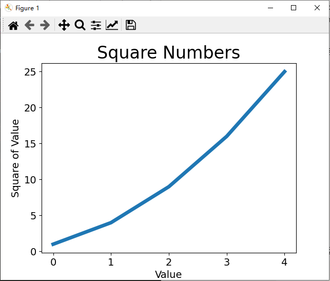

参数linewidth决定了plot()绘制的线条的粗细，而函数title()则指定了标题的大小。

函数xlabel()和ylabel()让你能够为每条轴设置标题；而函数tick_params()设置刻度的样式，其中指定的实参将影响x轴和y轴的刻度（axes=’both’），并将刻度标记的字号设置为14（labelsize=14）。

另外这个折线图和我们所希望的折线图是存在着差距的，我们可以发现这个折线图是从0开始的，并且此时的y值并不是0而是1，为了解决这个问题，我们需要进行额外的设置：

```
import matplotlib.pyplot as plt
input_values = [1, 2, 3, 4, 5]
squares = [1, 4, 9, 16, 25]
plt.plot(input_values, squares, linewidth=5) 

# 设置图表标题，并给坐标轴加上标签
plt.title("Square Numbers", fontsize=24)
plt.xlabel("Value", fontsize=14)
plt.ylabel("Square of Value", fontsize=14)

# 设置刻度标记的大小
plt.tick_params(axis='both', labelsize=14)

plt.show()
```

运行的结果为：


## 使用matplotlib绘制散点图

如果要绘制单个点，我们可以使用scatter()来进行绘制，并且向其中传递一对x和y的坐标，用来在指定位置绘制一个点：

```
import matplotlib.pyplot as plt
plt.scatter(2, 4)
plt.show()
```

得到的结果如下所示：

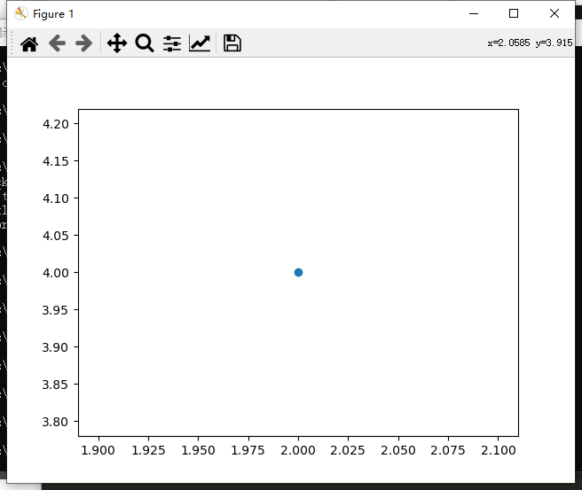

下面来设置输出的样式，使其更有趣：添加标题，给轴加上标签，并确保所有文本都大到能够看清：

```
import matplotlib.pyplot as plt
plt.scatter(2, 4, s=200)

# 设置图表标题并给坐标轴加上标签
plt.title("Square Numbers", fontsize=24)
plt.xlabel("Value", fontsize=14)
plt.ylabel("Square of Value", fontsize=14)
# 设置刻度标记的大小
plt.tick_params(axis='both', which='major', labelsize=14)
plt.show()
```

运行结果为：

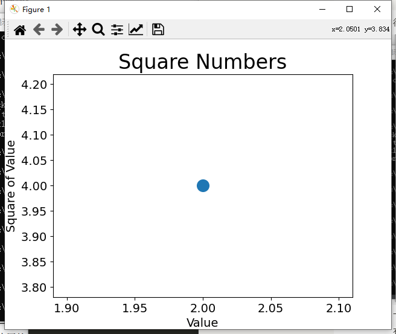

我们可以绘制一系列的点：

```
import matplotlib.pyplot as plt
x_values = [1, 2, 3, 4, 5]
y_values = [1, 4, 9, 16, 25]
plt.scatter(x_values, y_values, s=100)

# 设置图表标题并给坐标轴加上标签
plt.title("Square Numbers", fontsize=24)
plt.xlabel("Value", fontsize=14)
plt.ylabel("Square of Value", fontsize=14)
# 设置刻度标记的大小
plt.tick_params(axis='both', which='major', labelsize=14)
plt.show()
```

运行的结果为：


## 自动计算数据

通过手工的方式来计算列表的效率非常的低下，我们可以通过循环的方式来完成这种计算：

```
import matplotlib.pyplot as plt
x_values = list(range(1, 1001))
y_values = [x**2 for x in x_values]
plt.scatter(x_values, y_values, s=40)

# 设置图表标题并给坐标轴加上标签
plt.title("Square Numbers", fontsize=24)
plt.xlabel("Value", fontsize=14)
plt.ylabel("Square of Value", fontsize=14)
# 设置刻度标记的大小
plt.tick_params(axis='both', which='major', labelsize=10)
plt.axis([0, 1100, 0, 1100000])
plt.show()
```

运行的结果为：


我们可以修改数据点的颜色：

```
import matplotlib.pyplot as plt
x_values = list(range(1, 1001))
y_values = [x**2 for x in x_values]
plt.scatter(x_values, y_values, c='red', edgecolor='yellow', s=40) 

# 设置图表标题并给坐标轴加上标签
plt.title("Square Numbers", fontsize=24)
plt.xlabel("Value", fontsize=14)
plt.ylabel("Square of Value", fontsize=14)
# 设置刻度标记的大小
plt.tick_params(axis='both', which='major', labelsize=10)
plt.axis([0, 1100, 0, 1100000])
plt.show()
```

运行的结果为：

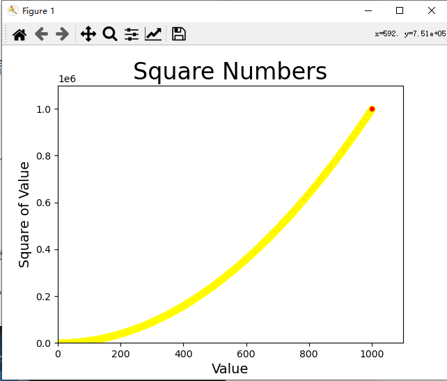

我们也可以选择消除数据点的轮廓：

```
import matplotlib.pyplot as plt
x_values = list(range(1, 1001))
y_values = [x**2 for x in x_values]
plt.scatter(x_values, y_values,edgecolor='none', s=40) 

# 设置图表标题并给坐标轴加上标签
plt.title("Square Numbers", fontsize=24)
plt.xlabel("Value", fontsize=14)
plt.ylabel("Square of Value", fontsize=14)
# 设置刻度标记的大小
plt.tick_params(axis='both', which='major', labelsize=10)
plt.axis([0, 1100, 0, 1100000])
plt.show()
```

我们还可以使用颜色映射，也就是从启示颜色渐变到结束颜色：

```
import matplotlib.pyplot as plt
x_values = list(range(1001))
y_values = [x**2 for x in x_values]
plt.scatter(x_values, y_values, c=y_values, cmap=plt.cm.Blues,
edgecolor='none', s=40) 

# 设置图表标题并给坐标轴加上标签
plt.title("Square Numbers", fontsize=24)
plt.xlabel("Value", fontsize=14)
plt.ylabel("Square of Value", fontsize=14)
# 设置刻度标记的大小
plt.tick_params(axis='both', which='major', labelsize=10)
plt.axis([0, 1100, 0, 1100000])
plt.show()
```

使用颜色映射可以用来展示数据的规律：

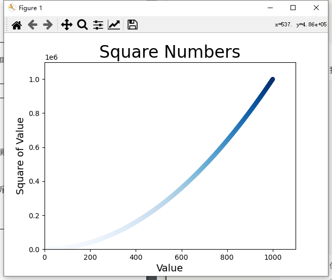

我们将参数c设置成了一个y值列表，并使用参数cmap告诉pyplot使用哪个颜色映射。这些代码将y值较小的点显示为浅蓝色，并将y值较大的点显示为深蓝色。

## 随机漫步

随机漫步是这样行走得到的路径：每次行走都完全是随机的，没有明确的方向，结果是由一系列随机决策决定的。

我们可以创建要给名为RandomWal的类，它可以随机的选择前进方向，但是这个类需要三个属性，其中一个是存储漫步次数的变量，其他两个是列表，分别存储随机漫步经过的每个x和y坐标。

RandomWalk类只包含两个方法：**init** ()和fill_walk()，其中后者计算随机漫步经过的所有点。

下面先来看看__init__()，如下所示：

```
from random import choice

class RandomWalk():
    """一个生成随机漫步数据的类"""

    def __init__(self, num_points=5000):
        """初始化随机漫步的属性"""
        self.num_points = num_points

        # 所有随机漫步都始于(0, 0)
        self.x_values = [0]
        
        self.y_values = [0]
```

为了做出随机决策，我们将所有可能的选择都存储在一个列表中，并且在每次做出决策时都使用choice()来决定使用那种选择。

接下来，我们将随机漫步包含的默认点数设置为5000，这大到足以生成有趣的模式，同时又足够小，可以确保能够快速地模拟随机漫步。

接着我们创建了连个用于存储x值和y值的列表，并且让每次漫步都从（0,0）出发。

在这之后，我们将会采用fill_walk()来生成漫步包含的点，并且决定每次漫步的方向：

```
from random import choice

class RandomWalk():
    """一个生成随机漫步数据的类"""

    def __init__(self, num_points=5000):
        """初始化随机漫步的属性"""
        self.num_points = num_points

        # 所有随机漫步都始于(0, 0)
        self.x_values = [0]
        
        self.y_values = [0] 

    def fill_walk(self):
    """计算随机漫步包含的所有点"""

      #不断漫步，直到列表达到指定的长度
      while len(self.x_values) < self.num_points:
        #决定前进方向以及沿着这个方向前进的距离
        x_direction = choice([1,-1])
        x_distance = choice([0, 1, 2, 3, 4])
        x_step = x_direction * x_distance

        y_direction = choice([1, -1])
        y_distance = choice([0, 1, 2, 3, 4])
        y_step = y_direction * y_distance

        #不要在原地踏步
        if x_step == 0 and y_step == 0:
          continue

        #计算下一个点的x和y的值
        next_x = self.x_values[-1] + x_step
        next_y = self.y_values[-1] + y_step

        self.x_values.append(next_x)
        self.y_value.append(next_y)
```

在原先的程序的基础上，我们建立了一个循环，这个循环会不断的运行，直到漫步包含所需数量的点。

我们使用choice([1, -1])给x_direction选择一个值，结果要么是表示向右走的1，要么是表示向左走的-1。接下来，choice([0, 1, 2, 3, 4])随机地选择一个0~4之间的整数，告诉Python 沿指定的方向走多远（x_distance）。

我们将移动方向乘以移动距离，以确定沿x和y轴移动的距离。如果x_step为正，将向右移动，为负将向左移动，而为零将垂直移动；如果y_step为正，就意味着向上移动，为负意味着向下移动，而为零意味着水平移动。如果x_step和y_step都为零，则意味着原地踏步，我们拒绝这样的情况，接着执行下一次循环。

为获取漫步中下一个点的x值，我们将x_step与x_values中的最后一个值相加，对于y值也做相同的处理。获得下一个点的x值和y值后，我们将它们分别附加到列表x_values和y_values的末尾。

然后我们创建一个名为rw_visual.py的文件，导入随机漫步类，并且绘制图片：

```
from random import choice

class RandomWalk():
    """一个生成随机漫步数据的类"""

    def __init__(self, num_points=5000):
        """初始化随机漫步的属性"""
        self.num_points = num_points

        # 所有随机漫步都始于(0, 0)
        self.x_values = [0]  
        self.y_values = [0] 

    def fill_walk(self):
        """计算随机漫步包含的所有点"""

        #不断漫步，直到列表达到指定的长度
        while len(self.x_values) < self.num_points:
            #决定前进方向以及沿着这个方向前进的距离
            x_direction = choice([1,-1])
            x_distance = choice([0, 1, 2, 3, 4])
            x_step = x_direction * x_distance

            y_direction = choice([1, -1])
            y_distance = choice([0, 1, 2, 3, 4])
            y_step = y_direction * y_distance

            #不要在原地踏步
            if x_step == 0 and y_step == 0:
                continue

            #计算下一个点的x和y的值
            next_x = self.x_values[-1] + x_step
            next_y = self.y_values[-1] + y_step

            self.x_values.append(next_x)
            self.y_values.append(next_y)
```

生成的结果为：


由于是随机生成的，所以每次的图片实际上都是不一样的，我们可以多尝试几次：

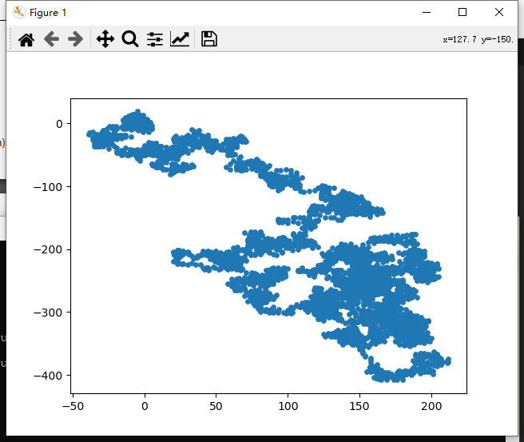


我们可以使用while循环来进行多次的随机漫步模拟：

```
import matplotlib.pyplot as plt
from random_walk import RandomWalk

# 只要程序处于活动状态，就不断地模拟随机漫步
while True:
  # 创建一个RandomWalk实例，并将其包含的点都绘制出来
  rw = RandomWalk()
  rw.fill_walk()
  plt.scatter(rw.x_values, rw.y_values, s=15)
  plt.show()
  keep_running = input("Make another walk? (y/n): ")
  if keep_running == 'n':
    break
```

为了突出每次漫步的重要特征，并且让分散注意力的元素不那么显眼，我们可以突出漫步的起点，终点和经过的路径，也就是给点着色：

```
import matplotlib.pyplot as plt
from random_walk import RandomWalk

while True:
  # 创建一个RandomWalk实例，并将其包含的点都绘制出来
  rw = RandomWalk()
  rw.fill_walk()
  point_numbers = list(range(rw.num_points))
  plt.scatter(rw.x_values, rw.y_values, c=point_numbers, cmap=plt.cm.Blues, edgecolor='none', s=15)
  plt.show()
  
  keep_running = input("Make another walk? (y/n): ")
  if keep_running == 'n':
    break
```

运行的结果如下所示：

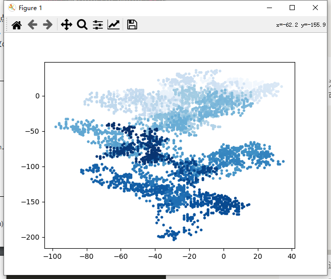


我们首先通过point_numbers = list(range(rw.num_points))来生成了一个数字列表，其中包含的数字个数与漫步包含的点数相同，并且这个列表被存储在point_numbers中，以便于后面使用它来设置每个漫步点数的颜色。

我们将参数c设置为point_numbers，指定使用颜色映射Blues，并传递实参edgecolor=none以删除每个点周围的轮廓。最终的随机漫步图从浅蓝色渐变为深蓝色。

我们可以在绘制随机漫步图后重新绘制起点和终点。我们让起点和终点变得更大，并显示为不同的颜色，以突出它们：

```
import matplotlib.pyplot as plt
from random_walk import RandomWalk

while True:
  # 创建一个RandomWalk实例，并将其包含的点都绘制出来
  rw = RandomWalk()
  rw.fill_walk()
  point_numbers = list(range(rw.num_points))
  plt.scatter(rw.x_values, rw.y_values, c=point_numbers, cmap=plt.cm.Blues, edgecolor='none', s=15)
  
  plt.scatter(0, 0, c='green', edgecolors='none', s=100)
  plt.scatter(rw.x_values[-1], rw.y_values[-1], c='red', edgecolors='none', s=100)

  # 隐藏坐标轴
  plt.axes().get_xaxis().set_visible(False)
  plt.axes().get_yaxis().set_visible(False) 

  plt.show() 

  keep_running = input("Make another walk? (y/n): ")
  if keep_running == 'n':
    break
```

为突出起点，我们使用绿色绘制点(0, 0)，并使其比其他点大（s=100）。为突出终点，我们在漫步包含的最后一个x和y值处绘制一个点，将其颜色设置为红色，并将尺寸设置为100。

运行结果为：


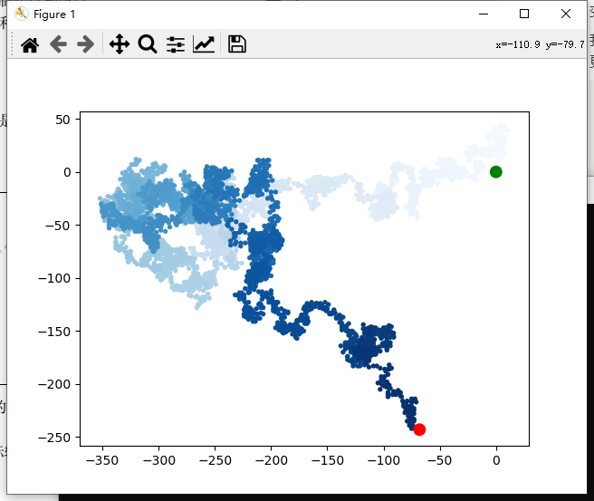

如果我们不需要坐标轴，我们可以这样设置：

```
import matplotlib.pyplot as plt
from random_walk import RandomWalk

while True:
  # 创建一个RandomWalk实例，并将其包含的点都绘制出来
  rw = RandomWalk()
  rw.fill_walk()
  point_numbers = list(range(rw.num_points))
  plt.scatter(rw.x_values, rw.y_values, c=point_numbers, cmap=plt.cm.Blues, edgecolor='none', s=15)
  
  plt.scatter(0, 0, c='green', edgecolors='none', s=100)
  plt.scatter(rw.x_values[-1], rw.y_values[-1], c='red', edgecolors='none', s=100)

  # 隐藏坐标轴
  plt.axes().get_xaxis().set_visible(False)
  plt.axes().get_yaxis().set_visible(False) 

  plt.show() 

  keep_running = input("Make another walk? (y/n): ")
  if keep_running == 'n':
    break
```

运行的结果为：


为修改坐标轴，使用了函数plt.axes()来将每条坐标轴的可见性都设置为False。

我们可以在创建RandomWalk实例的时候增大num_points的值，并且在绘图时调整每个点的大小：

```
import matplotlib.pyplot as plt
from random_walk import RandomWalk

while True:
  # 创建一个RandomWalk实例，并将其包含的点都绘制出来
  rw = RandomWalk(50000)
  rw.fill_walk()

  # 绘制点并将图形显示出来
  point_numbers = list(range(rw.num_points))

  plt.scatter(rw.x_values, rw.y_values, c=point_numbers, cmap=plt.cm.Blues, edgecolor='none', s=1) 

  point_numbers = list(range(rw.num_points))
  plt.scatter(rw.x_values, rw.y_values, c=point_numbers, cmap=plt.cm.Blues, edgecolor='none', s=15)
  
  plt.scatter(0, 0, c='green', edgecolors='none', s=100)
  plt.scatter(rw.x_values[-1], rw.y_values[-1], c='red', edgecolors='none', s=100)

  # 隐藏坐标轴
  plt.axes().get_xaxis().set_visible(False)
  plt.axes().get_yaxis().set_visible(False) 

  plt.show() 

  keep_running = input("Make another walk? (y/n): ")
  if keep_running == 'n':
    break
```

这这里模拟了一次包含50000个点的随机漫步，并且将每个点的大小都设置为1。

运行的结果如下所示：

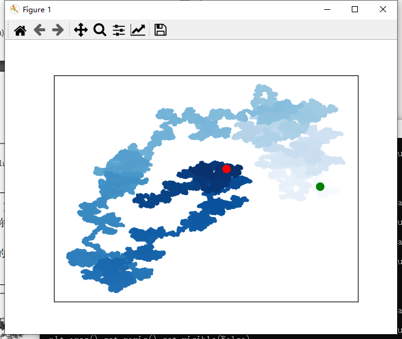

为了方便我们进行观察，我们可以设置matplotlib的输出的尺寸：

```
import matplotlib.pyplot as plt
from random_walk import RandomWalk

while True:
  # 创建一个RandomWalk实例，并将其包含的点都绘制出来
  rw = RandomWalk(50000)
  rw.fill_walk()

  #设置窗口的尺寸
  plt.figure(figsize = (10, 6))

  # 绘制点并将图形显示出来
  point_numbers = list(range(rw.num_points))

  plt.scatter(rw.x_values, rw.y_values, c=point_numbers, cmap=plt.cm.Blues, edgecolor='none', s=1) 

  point_numbers = list(range(rw.num_points))
  plt.scatter(rw.x_values, rw.y_values, c=point_numbers, cmap=plt.cm.Blues, edgecolor='none', s=15)
  
  plt.scatter(0, 0, c='green', edgecolors='none', s=100)
  plt.scatter(rw.x_values[-1], rw.y_values[-1], c='red', edgecolors='none', s=100)

  # 隐藏坐标轴
  plt.axes().get_xaxis().set_visible(False)
  plt.axes().get_yaxis().set_visible(False) 

  plt.show() 

  keep_running = input("Make another walk? (y/n): ")
  if keep_running == 'n':
    break
```

运行的结果为：

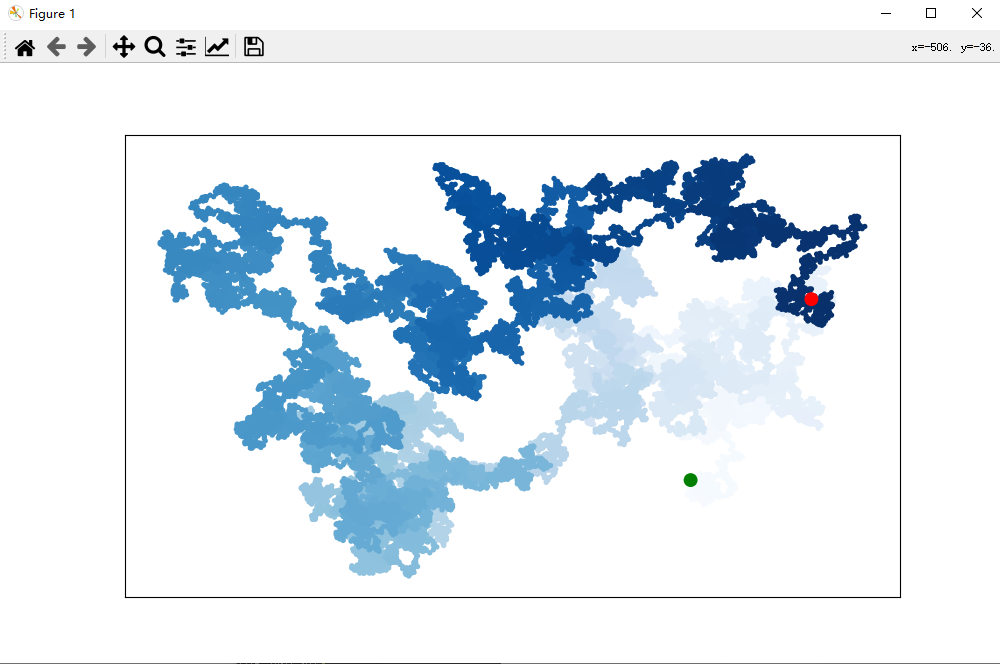

## 使用Pygal模拟骰子

我们首先要使用pip来安装Pygal：

```
pip3 install Pygal
```

然后我们可以创建一个die类来模拟骰子：

```
from random import randint

class Die():
  """表示一个骰子的类"""

  def __init__(self, num_sides = 6):
    """骰子默认为6面"""
    self.num_sides = num_sides

  def roll(self):
    """返回一个位于1和骰子面数之间的随机值"""
    return randint(1, self.num_sides)
```

方法__init__()接受一个可选参数。创建这个类的实例时，如果没有指定任何实参，面数默认为6；如果指定了实参，这个值将用于设置骰子的面数。骰子是根据面数命名的，6面的骰子名为D6，8面的骰子名为D8，以此类推。

方法roll()使用函数randint()来返回一个1和面数之间的随机数。这个函数可能返回起始值1、终止值num_sides或这两个值之间的任何整数。

然后我们可以投掷骰子，并且将结果打印出来，并且检查结果是否合理：

```
from die import Die
# 创建一个D6
die = Die()
# 掷几次骰子，并将结果存储在一个列表中
results = []

for roll_num in range(100):
  result = die.roll()
  results.append(result)

print(results)
```

以下是一个示例结果集：

```
[3, 3, 2, 1, 3, 4, 4, 4, 1, 2, 3, 3, 4, 1, 6, 3, 3, 6, 3, 1, 5, 5, 5, 4, 1, 5, 6, 1, 2, 3, 5, 3, 5, 3, 4, 3, 1, 6, 4, 5, 6, 3, 6, 1, 1, 1, 6, 2, 3, 2, 1, 1, 2, 3, 4, 6, 3, 6, 4, 3, 6, 5, 4, 1, 6, 1, 2, 6, 4, 1, 4, 6, 1, 4, 6, 4, 1, 4, 5, 3, 3, 3, 4, 2, 5, 2, 1, 4, 6, 1, 4, 1, 3, 1, 6, 4, 6, 6, 2, 1]
```

我们可以分析每一个点数出现的次数：

```
from die import Die
# 创建一个D6
die = Die()
# 掷几次骰子，并将结果存储在一个列表中
results = []

for roll_num in range(100):
  result = die.roll()
  results.append(result)

# 分析结果
frequencies = []
for value in range(1, die.num_sides+1):
  frequency = results.count(value)
  frequencies.append(frequency)

print(frequencies)
```

运行的结果为：

```
[14, 22, 16, 17, 20, 11]
```

总体上来讲是合理的，我们可以试着多投几次，比如说投10000次数：

```
from die import Die
# 创建一个D6
die = Die()
# 掷几次骰子，并将结果存储在一个列表中
results = []

for roll_num in range(10000):
  result = die.roll()
  results.append(result)

# 分析结果
frequencies = []
for value in range(1, die.num_sides+1):
  frequency = results.count(value)
  frequencies.append(frequency)

print(frequencies)
```

得到的结果为：

```
[1646, 1727, 1676, 1666, 1632, 1653]
```

可以发现出现的次数是非常的合理的。

或者我们可以将其可视化，当我们有了用来表示频率的列表之后，我们可以绘制一个结果的直方图：

```
import pygal
from die import Die
# 创建一个D6
die = Die()
# 掷几次骰子，并将结果存储在一个列表中
results = []

for roll_num in range(10000):
  result = die.roll()
  results.append(result)

# 分析结果
frequencies = []
for value in range(1, die.num_sides+1):
  frequency = results.count(value)
  frequencies.append(frequency)

# 对结果进行可视化
hist = pygal.Bar()

hist.title = "Results of rolling one D6 10000 times."
hist.x_labels = ['1', '2', '3', '4', '5', '6']
hist.x_title = "Result"
hist.y_title = "Frequency of Result"

hist.add('D6', frequencies)
hist.render_to_file('die_visual.svg')
```

我们首先创建了一个个pygal.Bar()实例例，并将其存储在hist中。

接下来，我们设置hist的属性title（用于标示直方图的字符串），将掷D6骰子的可能结果用作x轴的标签，并给每个轴都添加了标题。

我们使用add()将一系列值添加到图表中（向它传递要给添加的值指定的标签，还有一个列表，其中包含将出现在图表中的值）。最后，我们将这个
图表渲染为一个SVG文件，这种文件的扩展名必须为.svg。

我们可以在件die_visual.py所在的文件夹找到件die_visual.svg文件，可以用浏览器打开这个文件，得到的结果如下所示：


我们可以试着将投掷的次数再增加，那么我们会得到的结果是：


可以发现随着投掷的次数的增加，各个点数出现的频率越发的接近。

# 使用API

## 使用 Web API

本章的可视化将基于来自GitHub的信息，这是一个让程序员能够协作开发项目的网站。我们将使用GitHub的API来请求有关该网站中Python项目的信息，然后使用Pygal生成交互式可视化，以呈现这些项目的受欢迎程度。

GitHub的API让你能够通过API调用来请求各种信息。要知道API调用是什么样的，请在浏览器的地址栏中输入如下地址并按回车键：

```
https://api.github.com/search/repositories?q=language:python&sort=stars
```

这个调用返回GitHub当前托管了多少个Python项目，还有有关最受欢迎的Python仓库的信息。下面来仔细研究这个调用。第一部分（https://api.github.com/）将请求发送到GitHub网站中响应API调用的部分；接下来的一部分（search/repositories）让API搜索GitHub上的所有仓库。

repositories后面的问号指出我们要传递一个实参。q表示查询，而等号让我们能够开始指定查询（q=）。通过使用language:python，我们指出只想获取主要语言为Python的仓库的信息。最后一部分（&sort=stars）指定将项目按其获得的星级进行排序。

下面显示了响应的前几行。从响应可知，该URL并不适合人工输入。

```
{
  "total_count": 8339355,
  "incomplete_results": true,
  "items": [
    {
      "id": 54346799,
      "node_id": "MDEwOlJlcG9zaXRvcnk1NDM0Njc5OQ==",
      "name": "public-apis",
      "full_name": "public-apis/public-apis",
      "private": false,
      "owner": {
        "login": "public-apis",
        "id": 51121562,
        "node_id": "MDEyOk9yZ2FuaXphdGlvbjUxMTIxNTYy",
        "avatar_url": "https://avatars.githubusercontent.com/u/51121562?v=4",
        "gravatar_id": "",
        "url": "https://api.github.com/users/public-apis",
        "html_url": "https://github.com/public-apis",
        "followers_url": "https://api.github.com/users/public-apis/followers",
        "following_url": "https://api.github.com/users/public-apis/following{/other_user}",
        "gists_url": "https://api.github.com/users/public-apis/gists{/gist_id}",
        "starred_url": "https://api.github.com/users/public-apis/starred{/owner}{/repo}",
        "subscriptions_url": "https://api.github.com/users/public-apis/subscriptions",
        "organizations_url": "https://api.github.com/users/public-apis/orgs",
        "repos_url": "https://api.github.com/users/public-apis/repos",
        "events_url": "https://api.github.com/users/public-apis/events{/privacy}",
        "received_events_url": "https://api.github.com/users/public-apis/received_events",
        "type": "Organization",
        "site_admin": false
      }
```

“total_count”后面的数字是在Github上面有的Python项目的总数，”incomplete_results”的值为false，据此我们知道请求是成功的（它并非不完整的）。倘若GitHub无法全面处理该API，它返回的这个值将为true。接下来的列表中显示了返回的”items”，其中包含GitHub上最受欢迎的Python项目的详细信息。

为了让向网站请求信息以及检查返回的响应，我们需要安装requests：

```
pip isntall --user requests
```

接着我们就可以编写一个程序，来执行API的调用和处理结果：

```
import requests

#执行API的调用和存储响应
url = "https://api.github.com/search/repositories?q=language:python&sort=stars"
r = requests.get(url)
print("Status code:", r.status_code)

#将API响应存储在一个变量中
response_dict = r.json()

#处理结果
print(response_dict.keys())
```

我们首先调用了requests模块，然后我们存储了API调用的URL，然后使用requests来执行调用。

我们调用get()并且将URL传递给它，再将响应对象存储在变量r中，响应对象包含一个名为status_code的属性，它让我们知道请求是否成功了。

接着，我们打印status_code来核实调用是否真的成功了。

这个API返回JSON格式的信息，因此我们使用方法json()将这些信息转换为一个Python字典。我们将转换得到的字典存储在response_dict中。

运行的结果为：

```
Status code: 200
dict_keys(['total_count', 'incomplete_results', 'items'])
```

状态码为200，因此我们知道请求成功了。响应字典只包含三个键：’items’、’total_count’和’incomplete_results’。

将API调用返回的信息存储到字典中后，就可以处理这个字典中的数据了。下面来生成一些概述这些信息的输出。这是一种不错的方式，可确认收到了期望的信息，进而可以开始研究感兴趣的信息：

```
import requests

#执行API的调用和存储响应
url = "https://api.github.com/search/repositories?q=language:python&sort=stars"
r = requests.get(url)
print("Status code:", r.status_code)

#将API响应存储在一个变量中
response_dict = r.json()
print("Total repositories:", response_dict['total_count'])

#探索与仓库有关的信息
repo_dicts = response_dict['items']
print("Repositories returned:", len(repo_dicts))

#研究第一个仓库
repo_dict = repo_dicts[0]
print("\nKeys:", len(repo_dict))

for key in sorted(repo_dict.keys()):
	print(key)
```

我们首先使用了：

```
print("Total repositories:", response_dict['total_count'])
```

打印了与total_count相关联的值，它指出了GitHub总共包含多少个Python仓库。

与’items’相关联的值是一个列表，其中包含很多字典，而每个字典都包含有关一个Python仓库的信息。我们将这个字典列表存储在repo_dicts中。接下来，我们打印repo_dicts的长度，以获悉我们获得了多少个仓库的信息。

为更深入地了解返回的有关每个仓库的信息，我们提取了repo_dicts中的第一个字典，并将其存储在repo_dict中。接下来，我们打印这个字典包含的键数，看看其中有多少信息。我们打印这个字典的所有键，看看其中包含哪些信息。

运行的结果为：

```
Status code: 200
Total repositories: 8404802
Repositories returned: 30

Keys: 78
allow_forking
archive_url
archived
assignees_url
blobs_url
branches_url
clone_url
collaborators_url
comments_url
commits_url
compare_url
contents_url
contributors_url
created_at
default_branch
deployments_url
description
disabled
downloads_url
events_url
fork
forks
forks_count
forks_url
full_name
git_commits_url
git_refs_url
git_tags_url
git_url
has_downloads
has_issues
has_pages
has_projects
has_wiki
homepage
hooks_url
html_url
id
is_template
issue_comment_url
issue_events_url
issues_url
keys_url
labels_url
language
languages_url
license
merges_url
milestones_url
mirror_url
name
node_id
notifications_url
open_issues
open_issues_count
owner
private
pulls_url
pushed_at
releases_url
score
size
ssh_url
stargazers_count
stargazers_url
statuses_url
subscribers_url
subscription_url
svn_url
tags_url
teams_url
topics
trees_url
updated_at
url
visibility
watchers
watchers_count
```

从上述结果可以发现，repo_dict包含有78个键。

我们可以来提取与repo_dict中与一些键相关联的值：

```
import requests

#执行API的调用和存储响应
url = "https://api.github.com/search/repositories?q=language:python&sort=stars"
r = requests.get(url)
print("Status code:", r.status_code)

#将API响应存储在一个变量中
response_dict = r.json()
print("Total repositories:", response_dict['total_count'])

#探索与仓库有关的信息
repo_dicts = response_dict['items']
print("Repositories returned:", len(repo_dicts))

#研究第一个仓库
repo_dict = repo_dicts[0]
print("\nKeys:", len(repo_dict))

print("\nSelected information about first repository:")
print('Name:', repo_dict['name'])
print('Owner:', repo_dict['owner']['login'])
print('Stars:', repo_dict['stargazers_count'])
print('Repository:', repo_dict['html_url'])
print('Created:', repo_dict['created_at'])
print('Updated:', repo_dict['updated_at'])
print('Description:', repo_dict['description'])
```

我们首先打印了项目的名字，接着使用owner来访问表示所有者的字典，接着我们使用键key来获取所有者的登录名，然后我们打印项目获得了多少个星的评级，以及项目在GitHub仓库的URL，最后我们打印出来了对仓库的描述。

运行的结果为：

```
Status code: 200
Total repositories: 8281074
Repositories returned: 30

Keys: 78

Selected information about first repository:
Name: public-apis
Owner: public-apis
Stars: 171308
Repository: https://github.com/public-apis/public-apis
Created: 2016-03-20T23:49:42Z
Updated: 2021-12-13T10:08:55Z
Description: A collective list of free APIs
```

由于我们需要覆盖多个仓库，所以我们将会实现一个循环：

```
import requests

#执行API的调用和存储响应
url = "https://api.github.com/search/repositories?q=language:python&sort=stars"
r = requests.get(url)
print("Status code:", r.status_code)

#将API响应存储在一个变量中
response_dict = r.json()
print("Total repositories:", response_dict['total_count'])

#探索与仓库有关的信息
repo_dicts = response_dict['items']
print("Repositories returned:", len(repo_dicts))

print("\nSelected information about each repository:")
for repo_dict in repo_dicts:
	print('\nName:', repo_dict['name'])
	print('Owner:', repo_dict['owner']['login'])
	print('Stars:', repo_dict['stargazers_count'])
	print('Repository:', repo_dict['html_url'])
	print('Description:', repo_dict['description'])
```

运行的结果为：

```
Status code: 200
Total repositories: 8208296
Repositories returned: 30

Selected information about each repository:

Name: public-apis
Owner: public-apis
Stars: 171308
Repository: https://github.com/public-apis/public-apis
Description: A collective list of free APIs

Name: system-design-primer
Owner: donnemartin
Stars: 154106
Repository: https://github.com/donnemartin/system-design-primer
Description: Learn how to design large-scale systems. Prep for the system design interview.  Includes Anki flashcards.

Name: Python
Owner: TheAlgorithms
Stars: 125402
Repository: https://github.com/TheAlgorithms/Python
Description: All Algorithms implemented in Python

Name: awesome-python
Owner: vinta
Stars: 109777
Repository: https://github.com/vinta/awesome-python
Description: A curated list of awesome Python frameworks, libraries, software and resources

Name: youtube-dl
Owner: ytdl-org
Stars: 103129
Repository: https://github.com/ytdl-org/youtube-dl
Description: Command-line program to download videos from YouTube.com and other video sites

Name: thefuck
Owner: nvbn
Stars: 65046
Repository: https://github.com/nvbn/thefuck
Description: Magnificent app which corrects your previous console command.

Name: transformers
Owner: huggingface
Stars: 55433
Repository: https://github.com/huggingface/transformers
Description: 🤗 Transformers: State-of-the-art Machine Learning for Pytorch, TensorFlow, and JAX.

Name: httpie
Owner: httpie
Stars: 52990
Repository: https://github.com/httpie/httpie
Description: As easy as /aitch-tee-tee-pie/ 🥧 Modern, user-friendly command-line HTTP client for the API era. JSON support, colors, sessions, downloads, plugins & more. https://twitter.com/httpie

Name: awesome-machine-learning
Owner: josephmisiti
Stars: 52093
Repository: https://github.com/josephmisiti/awesome-machine-learning
Description: A curated list of awesome Machine Learning frameworks, libraries and software.

Name: ansible
Owner: ansible
Stars: 51011
Repository: https://github.com/ansible/ansible
Description: Ansible is a radically simple IT automation platform that makes your applications and systems easier to deploy and maintain. Automate everything from code deployment to network configuration to cloud management, in a language that approaches plain English, using SSH, with no agents to install on remote systems. https://docs.ansible.com.

Name: core
Owner: home-assistant
Stars: 48131
Repository: https://github.com/home-assistant/core
Description: :house_with_garden: Open source home automation that puts local control and privacy first.

Name: you-get
Owner: soimort
Stars: 42588
Repository: https://github.com/soimort/you-get
Description: :arrow_double_down: Dumb downloader that scrapes the web

Name: face_recognition
Owner: ageitgey
Stars: 42474
Repository: https://github.com/ageitgey/face_recognition
Description: The world's simplest facial recognition api for Python and the command line

Name: scrapy
Owner: scrapy
Stars: 42324
Repository: https://github.com/scrapy/scrapy
Description: Scrapy, a fast high-level web crawling & scraping framework for Python.

Name: cpython
Owner: python
Stars: 41718
Repository: https://github.com/python/cpython
Description: The Python programming language

Name: big-list-of-naughty-strings
Owner: minimaxir
Stars: 41617
Repository: https://github.com/minimaxir/big-list-of-naughty-strings
Description: The Big List of Naughty Strings is a list of strings which have a high probability of causing issues when used as user-input data.

Name: manim
Owner: 3b1b
Stars: 39584
Repository: https://github.com/3b1b/manim
Description: Animation engine for explanatory math videos

Name: fastapi
Owner: tiangolo
Stars: 39290
Repository: https://github.com/tiangolo/fastapi
Description: FastAPI framework, high performance, easy to learn, fast to code, ready for production

Name: localstack
Owner: localstack
Stars: 37640
Repository: https://github.com/localstack/localstack
Description: 💻  A fully functional local AWS cloud stack. Develop and test your cloud & Serverless apps offline!

Name: funNLP
Owner: fighting41love
Stars: 35385
Repository: https://github.com/fighting41love/funNLP
Description: 中英文敏感词、语言检测、中外手机/电话归属地/运营商查询、名字推断性别、手机号抽取、身份证抽取、邮箱抽取、中 日文人名库、中文缩写库、拆字词典、词汇情感值、停用词、反动词表、暴恐词表、繁简体转换、英文模拟中文发音、汪峰歌词生成器、职业名称词库、同义词库、反义词库、否定词库、汽车品牌词库、汽车零件词库、连续英文切割、各种中文词向量、公司名字大全、古诗词库、IT词库、财经词库、成语词库、地名词库、历史名人词库、诗词词库、医学词库、饮食词库、法律词库、汽车词库、动物词库、中文聊天语料、中文谣言数据、百度中文问答数据集、句子相似度匹配算法集合、bert资源、文本生成&摘要相关工具、cocoNLP信息抽取工具、国内电话号码正则匹配、清华大学XLORE:中英文跨语言百科知识图谱、清华大学人工智能技术系列报告、自然语言生成、NLU太难了 系列、自动对联数据及机器人、用户名黑名单列表、罪名法务名词及分类模型、微信公众号语料、cs224n深度学习自然语言处理课程、中文手写汉字识别、中文自然语言处理 语料/数据集、变量命名神器、分词语料库+代码、任务型对话英文数据集、ASR 语音数据集 + 基于深度学习的中文语音识别系统、笑声检测器、Microsoft多语言数字/单位/如日期时间识别包、中华新华字典数据库及api(包括常用歇后 语、成语、词语和汉字)、文档图谱自动生成、SpaCy 中文模型、Common Voice语音识别数据集新版、神经网络关系抽取、基于bert的命 名实体识别、关键词(Keyphrase)抽取包pke、基于医疗领域知识图谱的问答系统、基于依存句法与语义角色标注的事件三元组抽取、依存句法分析4万句高质量标注数据、cnocr：用来做中文OCR的Python3包、中文人物关系知识图谱项目、中文nlp竞赛项目及代码汇总、中文 字符数据、speech-aligner: 从“人声语音”及其“语言文本”产生音素级别时间对齐标注的工具、AmpliGraph: 知识图谱表示学习(Python)库：知识图谱概念链接预测、Scattertext 文本可视化(python)、语言/知识表示工具：BERT & ERNIE、中文对比英文自然语言处理NLP的区别综述、Synonyms中文近义词工具包、HarvestText领域自适应文本挖掘工具（新词发现-情感分析-实体链接等）、word2word：(Python)方便易用的多语言词-词对集：62种语言/3,564个多语言对、语音识别语料生成工具：从具有音频/字幕的在线视频创建自动语音识别(ASR)语料库、构建医疗实体识别的模型（包含词典和语料标注）、单文档非监督的关键词抽取、Kashgari中使用gpt-2语言模型、开源的金融投资数据提取工具、文本自动摘要库TextTeaser: 仅支持英文、人民日报语料处理工具集、一些关于自然语言的基本模型、基于14W歌曲知识库的问答尝试--功能包括歌词接龙and已知歌词找歌曲以及歌曲歌手歌词三角关系的问答、基于Siamese bilstm模型的相似句子判定模型并提供训练数据集和测试数据集、用Transformer编解码模型实现的根据Hacker News文章标题自动生成评论、用BERT进行序列标记和文本分类的模板代码、LitBank：NLP数据集——支持自然语言处理和计算人文学科任务的100部带标记英文小说语料、百度开源的基 准信息抽取系统、虚假新闻数据集、Facebook: LAMA语言模型分析，提供Transformer-XL/BERT/ELMo/GPT预训练语言模型的统一访问接口、CommonsenseQA：面向常识的英文QA挑战、中文知识图谱资料、数据及工具、各大公司内部里大牛分享的技术文档 PDF 或者 PPT、自然语言生成SQL语句（英文）、中文NLP数据增强（EDA）工具、英文NLP数据增强工具 、基于医药知识图谱的智能问答系统、京东商品知识 图谱、基于mongodb存储的军事领域知识图谱问答项目、基于远监督的中文关系抽取、语音情感分析、中文ULMFiT-情感分析-文本分类-语料及模型、一个拍照做题程序、世界各国大规模人名库、一个利用有趣中文语料库 qingyun 训练出来的中文聊天机器人、中文聊天机器 人seqGAN、省市区镇行政区划数据带拼音标注、教育行业新闻语料库包含自动文摘功能、开放了对话机器人-知识图谱-语义理解-自然语 言处理工具及数据、中文知识图谱：基于百度百科中文页面-抽取三元组信息-构建中文知识图谱、masr: 中文语音识别-提供预训练模型-高识别率、Python音频数据增广库、中文全词覆盖BERT及两份阅读理解数据、ConvLab：开源多域端到端对话系统平台、中文自然语言处 理数据集、基于最新版本rasa搭建的对话系统、基于TensorFlow和BERT的管道式实体及关系抽取、一个小型的证券知识图谱/知识库、复 盘所有NLP比赛的TOP方案、OpenCLaP：多领域开源中文预训练语言模型仓库、UER：基于不同语料+编码器+目标任务的中文预训练模型仓 库、中文自然语言处理向量合集、基于金融-司法领域(兼有闲聊性质)的聊天机器人、g2pC：基于上下文的汉语读音自动标记模块、Zincbase 知识图谱构建工具包、诗歌质量评价/细粒度情感诗歌语料库、快速转化「中文数字」和「阿拉伯数字」、百度知道问答语料库、基 于知识图谱的问答系统、jieba_fast 加速版的jieba、正则表达式教程、中文阅读理解数据集、基于BERT等最新语言模型的抽取式摘要提取、Python利用深度学习进行文本摘要的综合指南、知识图谱深度学习相关资料整理、维基大规模平行文本语料、StanfordNLP 0.2.0： 纯Python版自然语言处理包、NeuralNLP-NeuralClassifier：腾讯开源深度学习文本分类工具、端到端的封闭域对话系统、中文命名实体识别：NeuroNER vs. BertNER、新闻事件线索抽取、2019年百度的三元组抽取比赛：“科学空间队”源码、基于依存句法的开放域文本知识三元组抽取和知识库构建、中文的GPT2训练代码、ML-NLP - 机器学习(Machine Learning)NLP面试中常考到的知识点和代码实现、nlp4han:中文自然语言处理工具集(断句/分词/词性标注/组块/句法分析/语义分析/NER/N元语法/HMM/代词消解/情感分析/拼写检查、XLM：Facebook的跨语言预训练语言模型、用基于BERT的微调和特征提取方法来进行知识图谱百度百科人物词条属性抽取、中文自然语言处理相关的开放任务-数据集-当前最佳结果、CoupletAI - 基于CNN+Bi-LSTM+Attention 的自动对对联系统、抽象知识图谱、MiningZhiDaoQACorpus - 580万百度知道问答数据挖掘项目、brat rapid annotation tool: 序列标注工具、大规模中文知识图谱数据：1.4亿实体、数据增 强在机器翻译及其他nlp任务中的应用及效果、allennlp阅读理解:支持多种数据和模型、PDF表格数据提取工具 、 Graphbrain：AI开源 软件库和科研工具，目的是促进自动意义提取和文本理解以及知识的探索和推断、简历自动筛选系统、基于命名实体识别的简历自动摘要、中文语言理解测评基准，包括代表性的数据集&基准模型&语料库&排行榜、树洞 OCR 文字识别 、从包含表格的扫描图片中识别表格和 文字、语声迁移、Python口语自然语言处理工具集(英文)、 similarity：相似度计算工具包，java编写、海量中文预训练ALBERT模型 、Transformers 2.0 、基于大规模音频数据集Audioset的音频增强 、Poplar：网页版自然语言标注工具、图片文字去除，可用于漫画翻译 、186种语言的数字叫法库、Amazon发布基于知识的人-人开放领域对话数据集 、中文文本纠错模块代码、繁简体转换 、 Python实现的多种文本可读性评价指标、类似于人名/地名/组织机构名的命名体识别数据集 、东南大学《知识图谱》研究生课程(资料)、. 英文拼写 检查库 、 wwsearch是企业微信后台自研的全文检索引擎、CHAMELEON：深度学习新闻推荐系统元架构 、 8篇论文梳理BERT相关模型进展与反思、DocSearch：免费文档搜索引擎、 LIDA：轻量交互式对话标注工具 、aili - the fastest in-memory index in the East 东半球最快并发索引 、知识图谱车音工作项目、自然语言生成资源大全 、中日韩分词库mecab的Python接口库、中文文本摘要/关键词提取、汉字字符特征提取器 (featurizer)，提取汉字的特征（发音特征、字形特征）用做深度学习的特征、中文生成任务基准测评 、中文缩写数据集、中文任务基准测评 - 代表性的数据集-基准(预训练)模型-语料库-baseline-工具包-排行榜、PySS3：面向可解释AI的SS3文本分类器机器可视化工具 、中文NLP数据集列表、COPE - 格律诗编辑程序、doccano：基于网页的开源协同多语言文本标注工具 、PreNLP： 自然语言预处理库、简单的简历解析器，用来从简历中提取关键信息、用于中文闲聊的GPT2模型：GPT2-chitchat、基于检索聊天机器人 多轮响应选择相关资源列表(Leaderboards、Datasets、Papers)、(Colab)抽象文本摘要实现集锦(教程 、词语拼音数据、高效模糊搜索 工具、NLP数据增广资源集、微软对话机器人框架 、 GitHub Typo Corpus：大规模GitHub多语言拼写错误/语法错误数据集、TextCluster：短文本聚类预处理模块 Short text cluster、面向语音识别的中文文本规范化、BLINK：最先进的实体链接库、BertPunc：基于BERT 的最先进标点修复模型、Tokenizer：快速、可定制的文本词条化库、中文语言理解测评基准，包括代表性的数据集、基准(预训练)模型 、语料库、排行榜、spaCy 医学文本挖掘与信息提取 、 NLP任务示例项目代码集、 python拼写检查库、chatbot-list - 行业内关于智 能客服、聊天机器人的应用和架构、算法分享和介绍、语音质量评价指标(MOSNet, BSSEval, STOI, PESQ, SRMR)、 用138GB语料训练的 法文RoBERTa预训练语言模型 、BERT-NER-Pytorch：三种不同模式的BERT中文NER实验、无道词典 - 有道词典的命令行版本，支持英汉互查和在线查询、2019年NLP亮点回顾、 Chinese medical dialogue data 中文医疗对话数据集 、最好的汉字数字(中文数字)-阿拉伯数字转换工具、 基于百科知识库的中文词语多词义/义项获取与特定句子词语语义消歧、awesome-nlp-sentiment-analysis - 情感分析、情 绪原因识别、评价对象和评价词抽取、LineFlow：面向所有深度学习框架的NLP数据高效加载器、中文医学NLP公开资源整理 、MedQuAD：(英文)医学问答数据集、将自然语言数字串解析转换为整数和浮点数、Transfer Learning in Natural Language Processing (NLP) 、 面向语音识别的中文/英文发音辞典、Tokenizers：注重性能与多功能性的最先进分词器、CLUENER 细粒度命名实体识别 Fine Grained Named Entity Recognition、 基于BERT的中文命名实体识别、中文谣言数据库、NLP数据集/基准任务大列表、nlp相关的一些论文及代码, 包括主题模型、词向量(Word Embedding)、命名实体识别(NER)、文本分类(Text Classificatin)、文本生成(Text Generation)、文本 相似性(Text Similarity)计算等，涉及到各种与nlp相关的算法，基于keras和tensorflow 、Python文本挖掘/NLP实战示例、 Blackstone：面向非结构化法律文本的spaCy pipeline和NLP模型通过同义词替换实现文本“变脸” 、中文 预训练 ELECTREA 模型: 基于对抗学习 pretrain Chinese Model 、albert-chinese-ner - 用预训练语言模型ALBERT做中文NER 、基于GPT2的特定主题文本生成/文本增广、开源预训练语言模型合集、多语言句向量包、编码、标记和实现：一种可控高效的文本生成方法、 英文脏话大列表 、attnvis：GPT2、BERT等transformer语言模型注意力交互可视化、CoVoST：Facebook发布的多语种语音-文本翻译语料库，包括11种语言(法语、德语、荷兰语、俄语、西班牙语、意大利语、土耳其语、波斯语、瑞典语、蒙古语和中文)的语音、文字转录及英文译文、Jiagu自然语言处理工具 -  以BiLSTM等模型为基础，提供知识图谱关系抽取 中文分词 词性标注 命名实体识别 情感分析 新词发现 关键词 文本摘要 文本聚类等功能、用unet实现对文档表格的自动检测，表格重建、NLP事件提取文献资源列表 、 金融领域自然语言处理研究资源大列表、CLUEDatasetSearch - 中英文NLP数据集：搜索所有中文NLP数据集，附常用英文NLP数据集 、medical_NER - 中文医学知识图谱命名实体识别 、(哈 佛)讲因果推理的免费书、知识图谱相关学习资料/数据集/工具资源大列表、Forte：灵活强大的自然语言处理pipeline工具集 、Python 字符串相似性算法库、PyLaia：面向手写文档分析的深度学习工具包、TextFooler：针对文本分类/推理的对抗文本生成模块、Haystack ：灵活、强大的可扩展问答(QA)框架、中文关键短语抽取工具

Name: shadowsocks
Owner: shadowsocks
Stars: 33087
Repository: https://github.com/shadowsocks/shadowsocks
Description: None

Name: interview_internal_reference
Owner: 0voice
Stars: 32959
Repository: https://github.com/0voice/interview_internal_reference
Description: 2021年最新总结，阿里，腾讯，百度，美团，头条等技术面试题目，以及答案，专家出题人分析汇总。

Name: PayloadsAllTheThings
Owner: swisskyrepo
Stars: 32722
Repository: https://github.com/swisskyrepo/PayloadsAllTheThings
Description: A list of useful payloads and bypass for Web Application Security and Pentest/CTF

Name: pandas
Owner: pandas-dev
Stars: 31977
Repository: https://github.com/pandas-dev/pandas
Description: Flexible and powerful data analysis / manipulation library for Python, providing labeled data structures similar to R data.frame objects, statistical functions, and much more

Name: Real-Time-Voice-Cloning
Owner: CorentinJ
Stars: 31782
Repository: https://github.com/CorentinJ/Real-Time-Voice-Cloning
Description: Clone a voice in 5 seconds to generate arbitrary speech in real-time

Name: openpilot
Owner: commaai
Stars: 31629
Repository: https://github.com/commaai/openpilot
Description: openpilot is an open source driver assistance system. openpilot performs the functions of Automated Lane Centering and Adaptive Cruise Control for over 150 supported car makes and models.

Name: Deep-Learning-Papers-Reading-Roadmap
Owner: floodsung
Stars: 31207
Repository: https://github.com/floodsung/Deep-Learning-Papers-Reading-Roadmap
Description: Deep Learning papers reading roadmap for anyone who are eager to learn this amazing tech!

Name: DeepFaceLab
Owner: iperov
Stars: 30237
Repository: https://github.com/iperov/DeepFaceLab
Description: DeepFaceLab is the leading software for creating deepfakes.

Name: bert
Owner: google-research
Stars: 29936
Repository: https://github.com/google-research/bert
Description: TensorFlow code and pre-trained models for BERT

Name: d2l-zh
Owner: d2l-ai
Stars: 28957
Repository: https://github.com/d2l-ai/d2l-zh
Description: 《动手学深度学习》：面向中文读者、能运行、可讨论。中英文版被55个国家的300所大学用于教学。
```

## 使用Pygal可视化仓库

我们首先来安装pygal模块：

```
pip3 install pygal
```

当我们有了一些有趣的数据之后，我们可以进行数据可视化，来呈现Github上Python项目的受欢迎程度。

我们创建一个交互式条形图：条形图的高度表示项目获得了多少个星。

```
import requests
import pygal
from pygal.style import LightColorizedStyle as LCS, LightenStyle as LS

#执行API的调用和存储响应
url = "https://api.github.com/search/repositories?q=language:python&sort=stars"
r = requests.get(url)
print("Status code:", r.status_code)

#将API响应存储在一个变量中
response_dict = r.json()
print("Total repositories:", response_dict['total_count'])

#探索与仓库有关的信息
repo_dicts = response_dict['items']

names, stars = [], []
for repo_dict in repo_dicts:
	names.append(repo_dict["name"])
	stars.append(repo_dict["stargazers_count"])

#可视化
my_style = LS("#333366", base_style = LCS)
chart = pygal.Bar(style= my_style, x_label_rotation = 45, show_legend = False)
chart.title = "Most-Starred Python Projects on Github"
chart.x_labels = names

chart.add('', stars)
chart.render_to_file("python_repos.svg")
```

我们首先导入了pygal以及要应用于图表的Pygal样式。接下来，打印API调用响应的状态以及找到的仓库总数，以便获悉API调用是否出现了问题。我们不再打印返回的有关项目的信息，因为将通过可视化来呈现这些信息。

我们首先使用：

```
names, stars = [], []
```

创建了两个空列表，用于存储将包含在图表中的信息。

我们需要每个项目的名称，用于给条形加上标签，我们还需要知道项目获得了多少个星，用于确定条形的高度。在循环中，我们将项目的名称和获得的星数附加到这些列表的末尾

接下来，我们使用LightenStyle类（别名LS）定义了一种样式，并将其基色设置为深蓝色。我们还传递了实参base_style，以使LightColorizedStyle类（别名LCS）。然后，我们使用Bar()创建一个简单的条形图，并向它传递了my_style。我们还传递了另外两个样式实参：让标签绕x轴旋转45度（x_label_rotation=45），并隐藏了图（show_legend=False），因为我们只在图表中绘制一个数据系列。接下来，我们给图表指定了标题，并将属性x_labels设置为列表names。

由于我们不需要给这个数据系列添加标签，因此在添加数据时，将标签设置成了空字符串。

运行的结果为：

```
Status code: 200
Total repositories: 7895797
```

和：


接着我们改进pygal图表：

```
import requests
import pygal
from pygal.style import LightColorizedStyle as LCS, LightenStyle as LS

#执行API的调用和存储响应
url = "https://api.github.com/search/repositories?q=language:python&sort=stars"
r = requests.get(url)
print("Status code:", r.status_code)

#将API响应存储在一个变量中
response_dict = r.json()
print("Total repositories:", response_dict['total_count'])

#探索与仓库有关的信息
repo_dicts = response_dict['items']

names, stars = [], []
for repo_dict in repo_dicts:
	names.append(repo_dict["name"])
	stars.append(repo_dict["stargazers_count"])

#可视化
my_style = LS("#333366", base_style = LCS)
my_config = pygal.Config()
my_config.x_labels_rotation = 45
my_config.show_legend = False
my_config.title_font_size = 24
my_config.label_font_size = 14
my_config.major_label_font_size = 18
my_config.truncate_label = 15
my_config.show_y_guides = False
my_config.width = 1000

chart = pygal.Bar(my_config, stule = my_style)
chart.title = "Most-Starred Python Projects on Github"
chart.x_labels = names

chart.add('', stars)
chart.render_to_file("python_repos.svg")
```

我们创建了一个Pygal类Config的实例，并将其命名为my_config。通过修改my_config的属性，可定制图表的外观。

我们设置了两个属性——x_label_rotation和show_legend，它们原来是在创建Bar实例时以关键字实参的方式传递的。

我们设置了图表标题、副标签和主标签的字体大小。在这个图表中，副标签是x轴上的项目名以及y轴上的大部分数字。主标签是y轴上为5000整数倍的刻度；这些标签应更大，以与副标签区分开来。

# 下载数据

## CSV文件格式

要在文本文件中存储数据，最简单的方式是将数据作为一系列以逗号分隔的值（CSV）写入文件。这样的文件称为CSV文件。例如，下面是一行CSV格式的天气数据：

```
2014-1-5,61,44,26,18,7,-1,56,30,9,30.34,30.27,30.15,,,,10,4,,0.00,0,,195
```

这里采用了一份文件：

[rxxn4qsjhw.csv](https://yejiu97.github.io/2022/10/30/Python编程：数据可视化/file/rxxn4qsjhw.csv)

这是阿拉斯加锡特卡2014年1月5日的天气数据，其中包含当天的最高气温和最低气温，还有众多其他数据。CSV文件对人来说阅读起来比较麻烦，但程序可轻松地提取并处理其中的值，这有助于加快数据分析过程。

## 分析CSV文件头

csv模块包含在Python标准库中，可用于分析CSV文件中的数据行，让我们能够快速提取感兴趣的值。下面先来查看这个文件的第一行，其中包含一系列有关数据的描述：

```
import csv

filename = 'sitka_weather_07-2014.csv'

with open(filename) as f:
    reader = csv.reader(f)
    header_row = next(reader) 
    print(header_row)
```

导入模块CSV后，我们将要使用的文件名称存储在filename中。接下来，我们打开这个文件，并且将结果文件对象存储在f中。

接着我们调用csv.reader()，并且将前面存储的文件对象作为实参传递给它，从而创建一个与该文件相关联的阅读器（reader）对象。我们将这个阅读器对象存储在reader中。

模块csv包含了函数next()，调用它并将阅读器对象传递给它时，它将返回文件中的下一行。

在前面的代码中，我们只调用了next()一次，因此得到的是文件的第一行，其中包含文件头。我们将返回的数据存储在header_row中。正如你看到的，header_row包含与天气相关的文件头，指出了每行都包含哪些数据：

```
['AKDT', 'Max TemperatureF', 'Mean TemperatureF', 'Min TemperatureF', 'Max Dew PointF', 'MeanDew PointF', 'Min DewpointF', 'Max Humidity', ' Mean Humidity', ' Min Humidity', ' Max Sea Level PressureIn', ' Mean Sea Level PressureIn', ' Min Sea Level PressureIn', ' Max VisibilityMiles', ' Mean VisibilityMiles', ' Min VisibilityMiles', ' Max Wind SpeedMPH', ' Mean Wind SpeedMPH', ' Max Gust SpeedMPH', 'PrecipitationIn', ' CloudCover', ' Events', ' WindDirDegrees']
```

reader处理文件中以逗号分隔的第一行数据，并将每项数据都作为一个元素存储在列表中。文件头AKDT表示阿拉斯加时间（Alaska Daylight Time），其位置表明每行的第一个值都是日期或时间。文件头Max TemperatureF指出每行的第二个值都是当天的最高华氏温度。可通过阅读其他的文件头来确定文件包含的信息类型。

为了让文件头数据更加容易被理解，将列表中的每个文件头以及其位置都打印出来：

```
import csv

filename = 'sitka_weather_07-2014.csv'

with open(filename) as f:
    reader = csv.reader(f)
    header_row = next(reader)
    for index, column_header in enumerate(header_row):
        print(index, column_header)
```

在这里我们使用了enumerate()函数，enumerate() 函数用于将一个可遍历的数据对象(如列表、元组或字符串)组合为一个索引序列，同时列出数据和数据下标。

输出结果如下所示：

```
0 AKDT
1 Max TemperatureF
2 Mean TemperatureF
3 Min TemperatureF
4 Max Dew PointF
5 MeanDew PointF
6 Min DewpointF
7 Max Humidity
8  Mean Humidity
9  Min Humidity
10  Max Sea Level PressureIn
11  Mean Sea Level PressureIn
12  Min Sea Level PressureIn
13  Max VisibilityMiles
14  Mean VisibilityMiles
15  Min VisibilityMiles
16  Max Wind SpeedMPH
17  Mean Wind SpeedMPH
18  Max Gust SpeedMPH
19 PrecipitationIn
20  CloudCover
21  Events
22  WindDirDegrees
```

从中可知，日期和最高气温分别存储在第0列和第1列。为研究这些数据，我们将处理sitka_weather_07-2014.csv中的每行数据，并提取其中索引为0和1的值。

知道需要哪些列中的数据后，我们来读取一些数据。首先读取每天的最高气温：

```
import csv

filename = 'sitka_weather_07-2014.csv'

with open(filename) as f:
    reader = csv.reader(f)
    header_row = next(reader)

    highs = []
    for row in reader:
        highs.append(row[1])

    print(highs)
```

运行的结果为：

```
['64', '71', '64', '59', '69', '62', '61', '55', '57', '61', '57', '59', '57', '61', '64', '61', '59', '63', '60', '57', '69', '63', '62', '59', '57', '57', '61', '59', '61', '61', '66']
```

我们创建了一个名为highs的空列表，再遍历文件中余下的各行。阅读器对象从其停留的地方继续往下读取CSV文件，每次都自动返回当前所处位置的下一行。由于我们已经读取了文件头行，这个循环将从第二行开始——从这行开始包含的是实际数据。每次执行该循环时，我们都将索引1处（第2列）的数据附加到highs末。

然后我们将这些数据转换为int类型的数字，再将其附加到列表末尾。这样，最终的列表将包含以数字表示的每日最高气温：

```
[64, 71, 64, 59, 69, 62, 61, 55, 57, 61, 57, 59, 57, 61, 64, 61, 59, 63, 60, 57, 69, 63, 62, 59, 57, 57, 61, 59, 61, 61, 66]
```

接下来我们就需要对这些数据进行可视化。

为可视化这些气温数据，我们首先使用matplotlib创建一个显示每日最高气温的简单图形，如下所示：

```
import csv
from matplotlib import pyplot as plt

filename = 'sitka_weather_07-2014.csv'

#从文件中获取最高气温
with open(filename) as f:
    reader = csv.reader(f)
    header_row = next(reader)
    highs = []
    for row in reader:
        high = int(row[1])
        highs.append(high)

#根据数据绘制图形
fig = plt.figure(dpi=128, figsize=(10,6))
plt.plot(highs, c="red")

#设置图形的格式
plt.title("Daily high temperatures, July 2014", fontsize = 24)
plt.xlabel("", fontsize = 16)
plt.ylabel("Temperature(F)", fontsize = 16)
plt.tick_params(axis="both", which = "major", labelsize = 16)

plt.show()
```

我们首先将最高气温列表传给了plot()，并且我们通过c=”red”传递以便将数据点绘制为红色。

接下来，我们设置了一些其他的格式，如字体大小和标签。

运行的结果为：


不过我们在上述的途中缺乏了x轴所表示的日期信息。

我们接下来要在图表中添加日期，使其更加有用。在天气数据文件中，第一个日期在第二行：

```
2014-7-1,64,56,50,53,51,48,96,83,58,30.19,--snip--
```

读取该数据时，获得的是一个字符串，因为我们需要想办法将字符串’2014-7-1’转换为一个表示相应日期的对象。为创建一个表示2014年7月1日的对象，可使用模块datetime中的方法strptime()。我们在终端会话中看看strptime()的工作原理：

```
Python 3.7.9 (tags/v3.7.9:13c94747c7, Aug 17 2020, 18:58:18) [MSC v.1900 64 bit (AMD64)] on win32
Type "help", "copyright", "credits" or "license" for more information.
>>> from datetime import datetime
>>> first_date = datetime.strptime("2014-7-1","%Y-%m-%d")
>>> print(first_date)
2014-07-01 00:00:00
```

我们首先导入了模块datetime中的tatetime类，然后调用方法strptime()，并且将包含所需日期的字符串作为第一个实参。

第二个实参则告诉了Python如何设置日期的格式，”%Y-“让Python将字符串中第一个连字符串前面的部分视为四位的年份；%m-则是让Python将第二个连字符前面的部分视为表示月份的数字；而“%d”让Python1将字符串的最后一部分视为月份中的一天。

方法strptime()可接受各种实参，并根据它们来决定如何解读日期。表16-1列出了其中一些这样的实参。

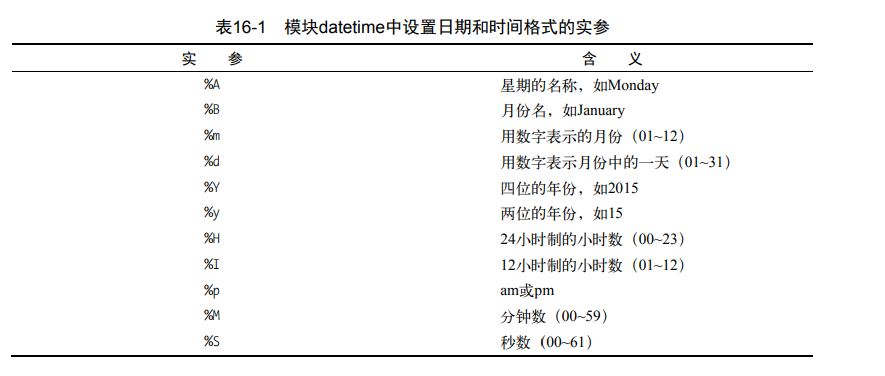

我们接着在图表中添加日期：

```
import csv
from datetime import datetime
from matplotlib import pyplot as plt

filename = 'sitka_weather_07-2014.csv'

#从文件中获取最高气温
with open(filename) as f:
    reader = csv.reader(f)
    header_row = next(reader)

    dates, highs = [], []
    for row in reader:
        current_date = datetime.strptime(row[0], "%Y-%m-%d")
        dates.append(current_date)
        high = int(row[1])
        highs.append(high)

    #根据数据绘制图形
fig = plt.figure(dpi=128, figsize=(10,6))
plt.plot(dates, highs, c="red")

#设置图形的格式
plt.title("Daily high temperatures, July 2014", fontsize = 24)
plt.xlabel("", fontsize = 16)
fig.autofmt_xdate()
plt.ylabel("Temperature(F)", fontsize = 16)
plt.tick_params(axis="both", which = "major", labelsize = 16)

plt.show()
```

运行的结果为：


我们创建了两个空列表，用于存储从文件中提取的日期和最高气温。然后，我们将包含日期信息的数据（row[0]）转换为datetime对象，并将其附加到列表dates末尾。我们将日期和最高气温值传递给plot()。我们调用了fig.autofmt_xdate()来绘制斜的日期标签，以免它们彼此重叠。

设置好图表之后，我们来添加更多的数据，好生成一副更加复杂的锡特卡天气图。

这时候我们需要使用到另一个数据文件：

[ibzwcepqx5.csv](https://yejiu97.github.io/2022/10/30/Python编程：数据可视化/file/ibzwcepqx5.csv)

基于这个数据文件，我们来以创建覆盖整年的天气图：

```
import csv
from datetime import datetime
from matplotlib import pyplot as plt

filename = 'sitka_weather_2014.csv'

#从文件中获取最高气温
with open(filename) as f:
    reader = csv.reader(f)
    header_row = next(reader)

    dates, highs, lows = [], [], []
    for row in reader:
        current_date = datetime.strptime(row[0], "%Y-%m-%d")
        dates.append(current_date)

        high = int(row[1])
        highs.append(high)

        low = int(row[3])
        lows.append(low)

    #根据数据绘制图形
fig = plt.figure(dpi=128, figsize=(10,6))
plt.plot(dates, highs, c="red")
plt.plot(dates, lows, c="blue")

#设置图形的格式
plt.title("Daily high temperatures - 2014", fontsize = 24)
plt.xlabel("", fontsize = 16)
fig.autofmt_xdate()
plt.ylabel("Temperature(F)", fontsize = 16)
plt.tick_params(axis="both", which = "major", labelsize = 16)

plt.show()
```

运行的结果为：

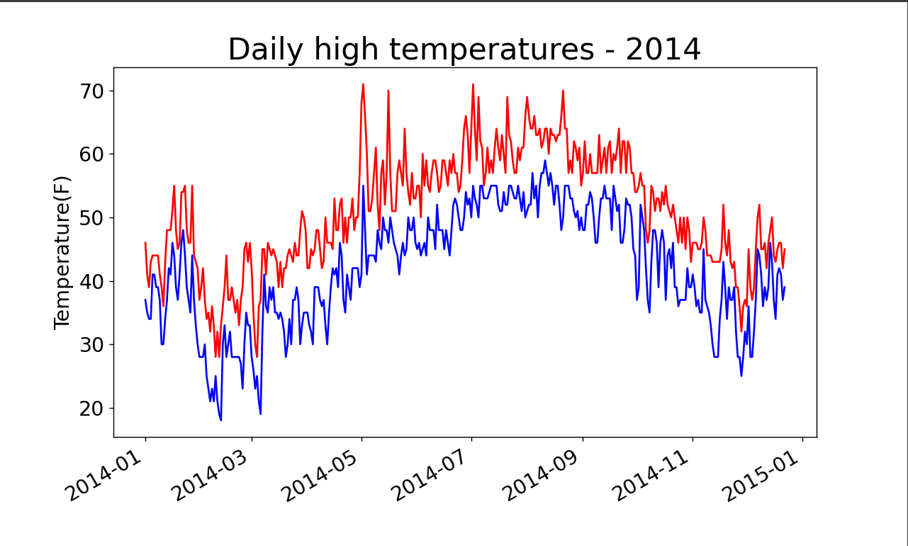

添加两个数据系列后，我们就可以了解每天的气温范围了。下面来给这个图表做最后的修饰，通过着色来呈现每天的气温范围。为此，我们将使用方法fill_between()，它接受一个x值系列和两个y值系列，并填充两个y值系列之间的空间：

```
import csv
from datetime import datetime
from matplotlib import pyplot as plt

filename = 'sitka_weather_2014.csv'

#从文件中获取最高气温
with open(filename) as f:
    reader = csv.reader(f)
    header_row = next(reader)

    dates, highs, lows = [], [], []
    for row in reader:
        current_date = datetime.strptime(row[0], "%Y-%m-%d")
        dates.append(current_date)

        high = int(row[1])
        highs.append(high)

        low = int(row[3])
        lows.append(low)

    #根据数据绘制图形
fig = plt.figure(dpi=128, figsize=(10,6))
plt.plot(dates, highs, c="red", alpha = 0.5)
plt.plot(dates, lows, c="blue", alpha = 0.5)
plt.fill_between(dates, highs, lows, facecolor = "blue", alpha = 0.1)

#设置图形的格式
plt.title("Daily high temperatures - 2014", fontsize = 24)
plt.xlabel("", fontsize = 16)
fig.autofmt_xdate()
plt.ylabel("Temperature(F)", fontsize = 16)
plt.tick_params(axis="both", which = "major", labelsize = 16)

plt.show()
```

运行的结果为：


我们指定了实参alpha来指定颜色的透明度，alpha的值如果等于0则意味着完全的透明，如果是1则是完全的不透明，我们这里选择了一个中间值。

接着我们向fill_between()传递了一个x值系列：列表dates，还传递了两个y值系列：highs和lows。实参facecolor指定了填充区域的颜色，我们还将alpha设置成了较小的值0.1，让填充区域将两个数据系列连接起来的同时不分散观察者的注意力。

## 错误检查

我们应该能够使用有关任何地方的天气数据来运行highs_lows.py中的代码，但有些气象站会偶尔出现故障，未能收集部分或全部其应该收集的数据。缺失数据可能会引发异常，如果不妥善地处理，还可能导致程序崩溃。

我们可以使用加利福尼亚的死亡谷的气温数据：

[-ct5-z2jch.csv](https://yejiu97.github.io/2022/10/30/Python编程：数据可视化/file/-ct5-z2jch.csv)

然后我们创建一个名为death_valley.py的文件，并且将full_year.py文件中的代码复制进来然后进行修改：

```
filename = 'death_valley_2014.csv'
```

进行运行发现：

```
Traceback (most recent call last):
  File "death_valley.py", line 19, in <module>
    high = int(row[1])
ValueError: invalid literal for int() with base 10: ''
```

这个traceback指出，Python无法处理其中一天的最高气温，因为它无法将空字符串’’转换为整数。

如果我们看一下death_valley_2014.csv中的数据，我们可以发现：

```
2014-2-16,,,,,,,,,,,,,,,,,,,0.00,,,-1
```

也就是说该数据文件中没有记录2012年2月116日的数据，用来表示最高温度的字符串为空。

这个时候我们就可以对分析数据集时可能出现的异常进行处理：

```
import csv
from datetime import datetime
from matplotlib import pyplot as plt

filename = 'death_valley_2014.csv'

#从文件中获取最高气温
with open(filename) as f:
    reader = csv.reader(f)
    header_row = next(reader)

    dates, highs, lows = [], [], []
    for row in reader:
        try:
            current_date = datetime.strptime(row[0], "%Y-%m-%d")
            high = int(row[1])
            low = int(row[3])
        except ValueError:
            print(current_date, 'missing data')
        else:
            dates.append(current_date)
            highs.append(high)
            lows.append(low)

    #根据数据绘制图形
fig = plt.figure(dpi=128, figsize=(10,6))
plt.plot(dates, highs, c="red", alpha = 0.5)
plt.plot(dates, lows, c="blue", alpha = 0.5)
plt.fill_between(dates, highs, lows, facecolor = "blue", alpha = 0.1)

#设置图形的格式
plt.title("Daily high and low temperatures - 2014\nDeath Valley, CA", fontsize = 24)
plt.xlabel("", fontsize = 16)
fig.autofmt_xdate()
plt.ylabel("Temperature(F)", fontsize = 16)
plt.tick_params(axis="both", which = "major", labelsize = 16)

plt.show()
```

只要确实其中一项数据，Python就会引发ValueError异常，这个时候我们就可以打印一条错误信息用来指出缺失数据的日期，然后接着循环处理下一行。

运行的结果为：

```
2014-02-16 00:00:00 missing data
```

和：

